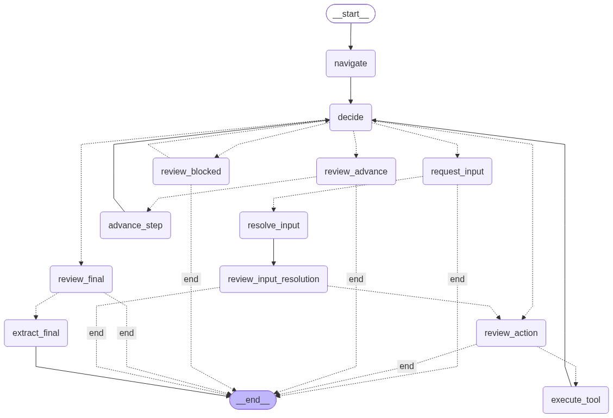

# WebAgentX

WebAgentX combines Groq planning, LangGraph orchestration, and Selenium browser
control to execute generic web tasks without hard-coded site workflows.

## Groq API key setup

1. Create an API key in the [Groq Console](https://console.groq.com/keys).
2. From the repository root, copy the environment template:

   ```shell
   cp .env.example .env
   ```

3. Open `.env` and replace the placeholder with your key:

   ```dotenv
   GROQ_API_KEY=your-groq-api-key
   ```

Keep `.env` private and never commit a real API key. The application loads
`GROQ_API_KEY` automatically; you can also enter a key temporarily in the
Streamlit sidebar.

The execution loop is:

1. Navigate and capture a bounded page snapshot, including open shadow roots.
2. Ask Groq for a validated `NextStepConfirmation` function call.
3. Convert the decision into a parameterized `click` or `type_text` tool call.
4. Pause for user approval before Selenium changes the browser.
5. Capture a new snapshot and repeat until final, grounded extraction.

LangGraph checkpoints only JSON-compatible plan, decision, and action-history
data. The live WebDriver, WebElements, and snapshots stay in the per-session
`BrowserRuntime`, so stale references are never serialized or restored.

## LangGraph flow



Run the app from the repository root:

```shell
streamlit run src/app.py
```
